## Step-by-step guide to GeoFRESH

This tutorial walks though the single steps of GeoFRESH using the test data set (random selection of fish occurrences, drawn from the Harmonised freshwater fish occurrence and abundance data for 12 federal states in Germany, downloaded from <a href="https://www.gbif.org/dataset/e0908eee-ad49-4e91-b4d0-1f05dd17b291" target="_blank">GBIF</a>).

GeoFRESH helps you link point locations (e.g., occurrence records or sampling sites) to the **Hydrography90m** river network and catchments, and then annotate those points with **environmental variables** at two scales: **local sub-catchment** and **upstream catchment**.

Point data can be created either by **uploading a CSV** or by **creating/editing points in the Point Editor** (Figure 1). Depending on your needs, you can follow one of several workflows.

<figure style="margin: 1rem 0; text-align: center;">
  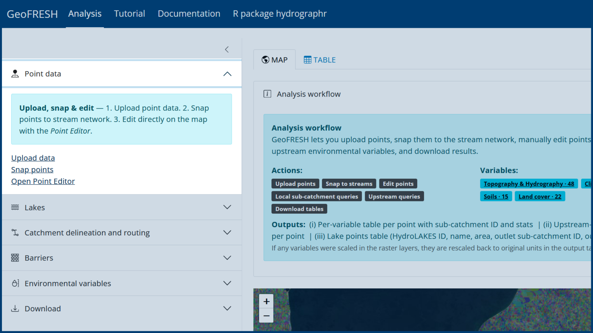
  <figcaption style="font-size: 0.9em; color: #666; margin-top: 0.4rem;">
    <strong>Figure 1.</strong> The <em>Point data</em> menu provides access to upload, snapping, and the Point Editor.
  </figcaption>
</figure>

---

# 1) Create your point data

## Option A — Upload points as CSV
Upload a **.csv** file containing point coordinates. The file must include:
- an **ID** column
- **latitude**
- **longitude**

Column names are flexible, but coordinates must be in **WGS84 (EPSG:4326)**.

<figure style="margin: 1rem 0; text-align: center;">
  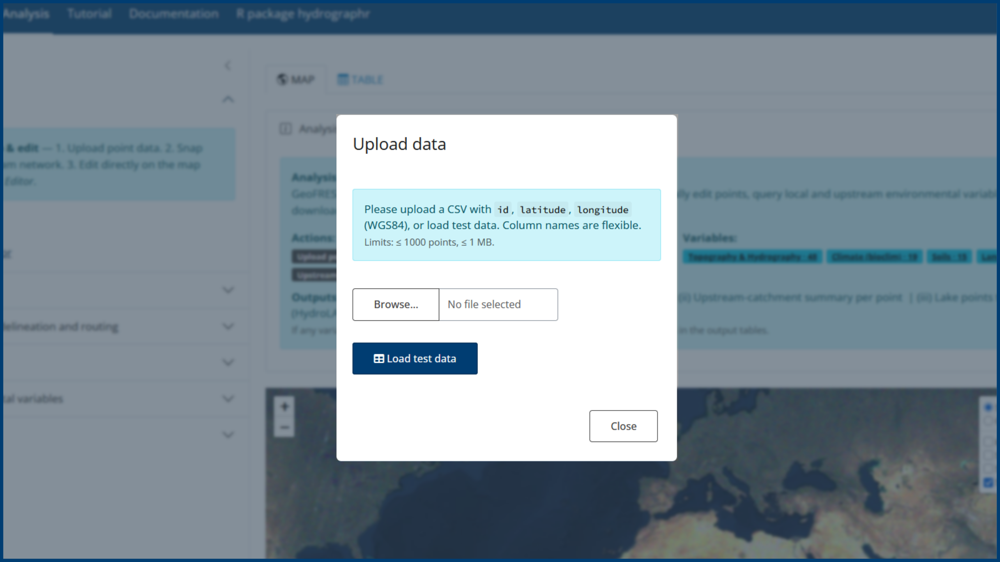
  <figcaption style="font-size: 0.9em; color: #666; margin-top: 0.4rem;">
    <strong>Figure 2.</strong> Upload a CSV with ID, latitude, and longitude (WGS84 / EPSG:4326) or load test data.
  </figcaption>
</figure>

After upload:
- points appear immediately on the map (Figure 3A)
- the table view allows inspection, filtering, and quality checks before processing (Figure 3B)

<figure style="margin: 1rem 0; text-align: center;">
  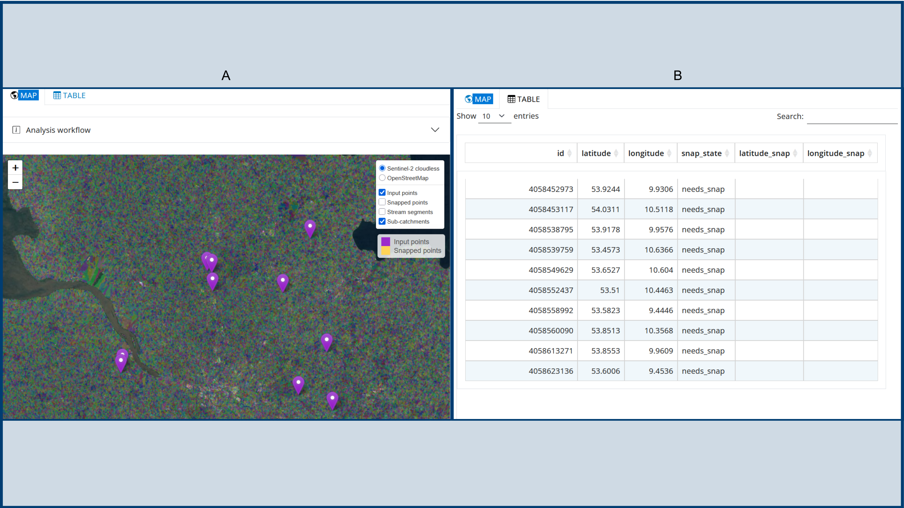
  <figcaption style="font-size: 0.9em; color: #666; margin-top: 0.4rem;">
    <strong>Figure 3.</strong> After upload, points appear on the map and can be inspected in the table before processing.
  </figcaption>
</figure>

## Option B — Create points in the Point Editor
Open the **Point Editor** (Figure 1) to create or refine points interactively:
- **Insert points** by placing markers on the map (Figure 4A) 
- **Move points** by dragging markers
- **Delete points** (Figure 4B) or keep (Figure 4C) a subset using selection tools:
  - polygon selection (Figure 4D)
  - bounding box (Figure 4E)
  - uploaded polygons (GeoPackage) (Figure 4F)
  - catchment-based selection (click-to-delineate) (Figure 4G)

This option is useful for digitizing points manually or correcting uploaded coordinates.

<figure style="margin: 1rem 0; text-align: center;">
  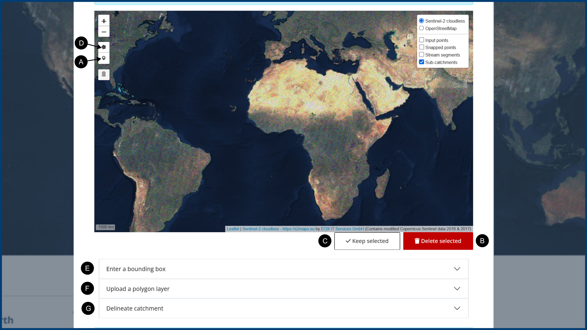
  <figcaption style="font-size: 0.9em; color: #666; margin-top: 0.4rem;">
    <strong>Figure 4.</strong> Use the <em>Point Editor</em> to insert, move, or delete points interactively.
  </figcaption>
</figure>

---

# 2) Snap points to the stream network

Snapping assigns each point to the Hydrography90m **regional unit**, **sub-catchment**, and **stream segment**, and places the point **exactly on the stream line**. A progress bar indicates status.

### Snapping methods
GeoFRESH provides two snapping methods (Figure 5):

1) **Sub-catchment snapping (default)**  
Points are snapped to the nearest stream segment **within the sub-catchment the point falls into**.

2) **Closest stream by Strahler order (optional)**  
Points are snapped to the nearest stream segment with a **selected Strahler order**, within a maximum search distance. Points farther than the maximum distance remain unsnapped.

<figure style="margin: 1rem 0; text-align: center;">
  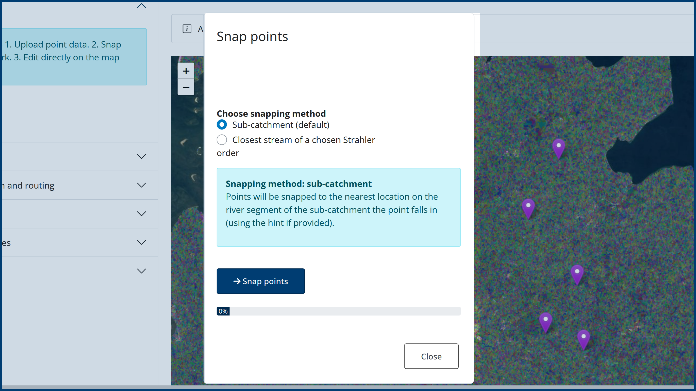
  <figcaption style="font-size: 0.9em; color: #666; margin-top: 0.4rem;">
    <strong>Figure 5.</strong> Snap points to Hydrography90m: choose sub-catchment snapping (default) or Strahler-order snapping (optional).
  </figcaption>
</figure>

---

# 3) Review snapped points

After snapping:
- snapped points are shown on the map (**yellow markers**) (Figure 6A)
- the data table includes additional snapped coordinate columns (Figure 6B)
- zooming in shows the point lies on the stream line (Figure 6A)

<figure style="margin: 1rem 0; text-align: center;">
  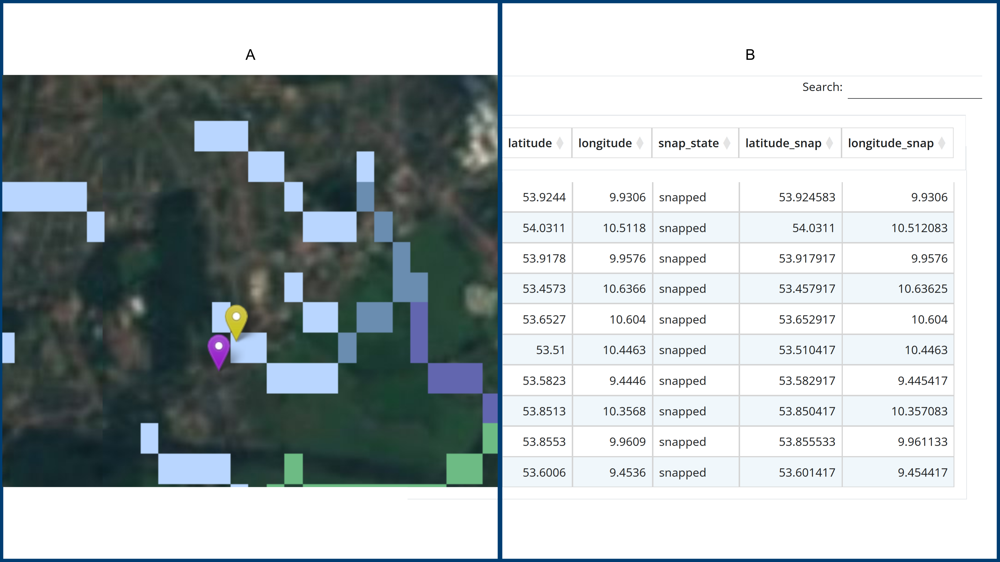
  <figcaption style="font-size: 0.9em; color: #666; margin-top: 0.4rem;">
    <strong>Figure 6.</strong> Review results by zooming in: snapped points (yellow markers) lie 
    exactly on the stream line (A) and are flagged in the table (B). The stream line shown 
    on the map is a raster visualization of the Hydrography90m network 
    (used to keep the web app responsive; rendering the full vector network would be slow). 
    In the backend (PostgreSQL/PostGIS), points are snapped to the vector stream segments of Hydrography90m.
  </figcaption>
</figure>

Manual correction concept (important):
If the initial snapping result is not what you expect, you can correct it in the **Point Editor**:

- Dragging a snapped marker creates a **manual hint** (your intended location).
- Snapping must then be run again to (Figure 7):
  - place the point precisely on the stream line
  - update its regional unit/sub-catchment/segment assignment consistently
  
<figure style="margin: 1rem 0; text-align: center;">
  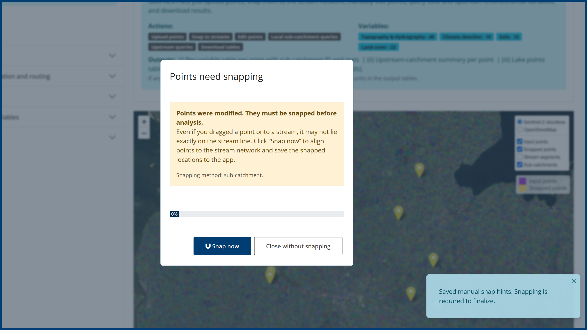
  <figcaption style="font-size: 0.9em; color: #666; margin-top: 0.4rem;">
    <strong>Figure 7.</strong> After moving a snapped point in the Point Editor (creating a <em>manual hint</em>), click <strong>Save changes</strong> to open the re-snapping dialog. Re-running snapping aligns the point to the stream network and updates its regional unit, sub-catchment, and stream segment assignments.
  </figcaption>
</figure>

---

# 4) Annotate points with environmental variables

Afterwards, you can annotate the point data with environmental information across the sub-catchment of each point. You can select from a suite of **48 variables related to**  
<a href="https://hydrography.org/hydrography90m/hydrography90m_layers" target="_blank">topography and hydrography</a>,  
**19** <a href="http://chelsa-climate.org" target="_blank">climate variables</a> (i.e., current bioclimatic variables),  
**15** <a href="https://soilgrids.org" target="_blank">soil</a> variables, and  
**22** <a href="http://maps.elie.ucl.ac.be/CCI/viewer/index.php" target="_blank">land cover</a> variables.

You can compute summaries for:

- **Local (sub-catchment) conditions** at each point  
- **Upstream catchment conditions** draining into each point

Click **Start query** to compute the results (Figure 8).

<figure style="margin: 1rem 0; text-align: center;">
  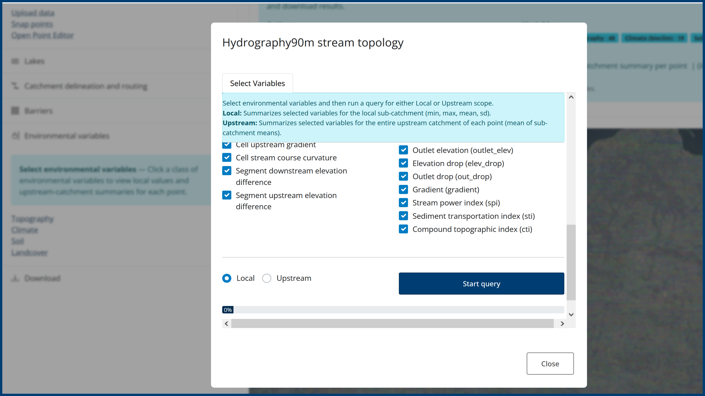
  <figcaption style="font-size: 0.9em; color: #666; margin-top: 0.4rem;">
    <strong>Figure 8.</strong> Select the environmental variables of interest, choose <strong>Local</strong>, and click <strong>Start query</strong> to annotate each point with sub-catchment (local) environmental conditions.
  </figcaption>
</figure>

### Outputs of environmental annotation
Each extraction (local or upstream) provides:

1) **Results table (CSV)**  
A table is generated and can be downloaded as a **CSV file** from the same menu where the extraction was run (Figure 9).

2) **Summary plot**  
A plot (Figure 9) is produced to summarize the selected variables (e.g., distributions for continuous variables and category summaries for categorical land-cover variables). This helps with quick interpretation and quality control before downloading.

<figure style="margin: 1rem 0; text-align: center;">
  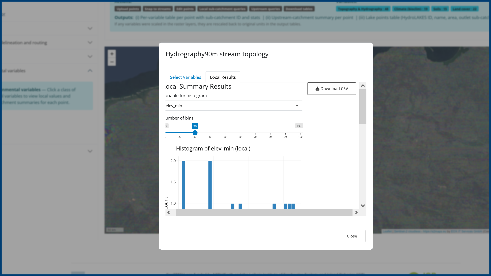
  <figcaption style="font-size: 0.9em; color: #666; margin-top: 0.4rem;">
    <strong>Figure 9.</strong> Click <strong>Download CSV</strong> to download environmental data corresponding to each point and inspect the summary plot.
  </figcaption>
</figure>

---

# 5) Download your data

GeoFRESH provides multiple download options depending on what you produced in the session.

## A) Download points from the Point Editor (CSV/GeoJSON/GPKG)
From the **Point Editor**, use **Save as…** to export a points file at any time (Figure 10). You can export:

- **Edited points** (your current working version after any changes)
- **Original coordinates** (latitude/longitude)
- **Snapped coordinates** (latitude_snap/longitude_snap), if snapping has been run

<figure style="margin: 1rem 0; text-align: center;">
  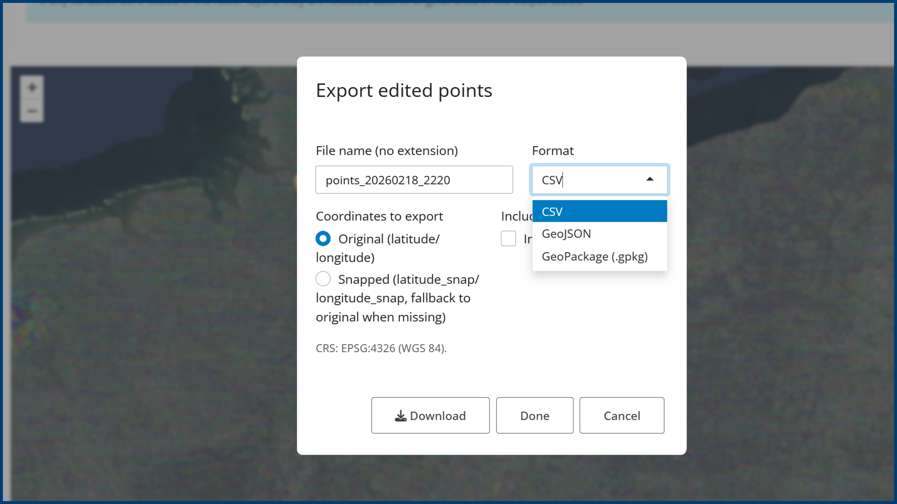
  <figcaption style="font-size: 0.9em; color: #666; margin-top: 0.4rem;">
    <strong>Figure 10.</strong> In the <strong>Point Editor</strong>, click <strong>Save as…</strong> to export your points (CSV/GeoJSON/GPKG), choosing between <em>edited</em>, <em>original</em>, or <em>snapped</em> coordinates (if available).
  </figcaption>
</figure>

  

## B) Download environmental tables from their respective menus (CSV)
Local and upstream environmental annotation tables can be downloaded as **CSV** directly from the menu where they were created (Figure 9).

## C) Download everything from the central Download menu (lateral sidebar)
A **central Download menu** (Figure 11) in the lateral sidebar allows you to download:

- any available output independently (points, local table, upstream table)
- or a bundled download (e.g., points + local + upstream), **provided those outputs exist** in your session

This is the easiest way to retrieve all outputs in one place.

<figure style="margin: 1rem 0; text-align: center;">
  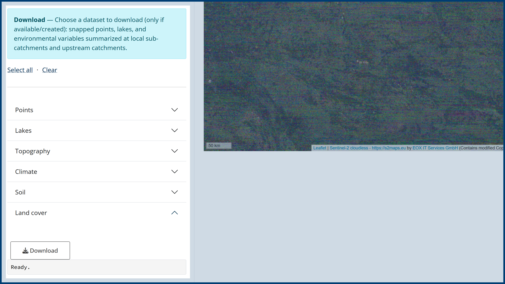
  <figcaption style="font-size: 0.9em; color: #666; margin-top: 0.4rem;">
    <strong>Figure 11.</strong> The central <strong>Download</strong> menu in the lateral sidebar lets you download available outputs individually (points, local topography table) or as a bundled export (e.g., points + local topography table), when those outputs exist in your session.
  </figcaption>
</figure>

---

# Common workflows

## Workflow 1 — Upload → Snap (menu) → Annotate → Download
1) Upload points as CSV  
2) Snap points from the lateral menu (choose method if needed)  
3) Annotate points (local and/or upstream) and inspect the summary plot  
4) Download tables (CSV) and/or use the central Download menu

Use this workflow when default snapping produces the expected results.

---

## Workflow 2 — Upload → Snap → Correct in Point Editor → Snap again → Annotate → Download
1) Upload points as CSV  
2) Snap points  
3) If some points are snapped to unexpected segments:
   - open the Point Editor
   - move points (provide manual hints)
4) Save changes and snap again to apply corrections and update assignments  
5) Annotate points and inspect plots  
6) Download point exports (original/snapped) and annotation tables

Use this workflow when you need interactive correction to achieve the intended stream placement.

---

## Workflow 3 — Create points in Point Editor → Snap → Annotate → Download
1) Create points manually in the Point Editor  
2) Save edits  
3) Snap points in the Point Editor 
4) Annotate points (local and/or upstream) and inspect plots  
5) Download exported points and annotation tables (or use the central Download menu)

Use this workflow when you want to build a dataset from scratch inside GeoFRESH.

---

# Data privacy and session behavior
All data are session-based. When you close the browser window, uploaded data and derived results are removed. No data are stored permanently on the platform.

---

## References
GBIF.org (24 April 2023) GBIF Occurrence Download. doi.org/10.15468/dl.xbuqe5
